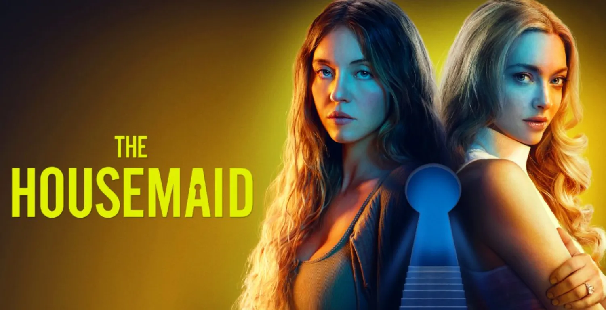

<!-- title: Housemaid Review — A Slow Burn with a Chilling Plot Twist -->
<!-- excerpt: An honest review of Housemaid. Beneath its slow pacing lies a deadly plot twist and a deeply satisfying tale of revenge! -->
<!-- image: ./housemaid.png -->
<!-- date: 2026-06-28 -->
<!-- posting_date: 2026-06-28 -->
<!-- tags: Movie Review, Housemaid, Thriller, Plot Twist, Drama -->

# 🧹 Housemaid Review
## A Slow Burn with a Chilling Plot Twist

The next movie I want to talk about is *Housemaid*. Honestly, this is a very unique thriller/drama that leaves a lasting impression long after the credits roll.

I'm giving this movie a solid **7/10**. At first, you might feel like it's dragging, but that slow pace is exactly where its brilliance lies! Let's dive in.

---

## ⏳ 1. A Masterfully Deceptive Slow Pace

For the first hour or so, the pacing feels incredibly slow. But ironically, that's what makes it so good.

The movie deliberately tricks us into thinking that the wife is just a crazy person who happens to live with an incredibly wealthy and infinitely patient husband. On top of that, seeing the housemaid constantly being gaslit makes us feel terrible for her. You can't help but wonder, "Are you sure you can handle working there?". The psychological manipulation and pity are perfectly built up during this first act.

---

## 🤯 2. A Brilliant and Unpredictable Plot Twist

Then, right after that slow-burn first hour, the main conflict drops. And, *boom*!

It turns out the real villain is the husband himself! Behind his patient facade, he is a total psychopath who enjoys torturing women and his partners. It's an absolutely brilliant plot twist. I honestly didn't even realize that was where the story was heading. The storytelling is so smooth and well-executed.

---

## 🎭 3. All-Out Acting with Zero Censorship

I also have to give massive praise to the acting. Every character's performance blends together perfectly, making the whole situation feel terrifyingly real.

Their dedication to the roles is commendable, going as far as showing the intimate scenes completely raw and uncensored, which adds to the bold and gritty nature of the film.

---

## 🔥 4. A Deeply Satisfying Tale of Revenge

The best part of this movie is undoubtedly its conclusion. The ending is phenomenal, and I guarantee you'll be immensely satisfied with how it plays out.

The aspect of revenge is very compelling, and it's exactly what needed to happen. All the tension built up throughout the movie pays off perfectly. As a bonus, there's a part of this movie I found strangely relatable: the husband works in tech, which explains how he could afford such a massive house and luxurious lifestyle. (Though, of course, I'm not the psychopath here, *haha*!).

---

## 🎬 Conclusion

*Housemaid* is a cleverly executed slow-burn movie. It tricks its audience in the beginning only to deliver a deadly surprise in the second half.

If you enjoy psychological thrillers packed with mystery and wrapped up with epic revenge, this is a must-watch!

**Final Score: 7/10** ⭐️

So, are you intrigued enough to watch it and experience the plot twist for yourself?
