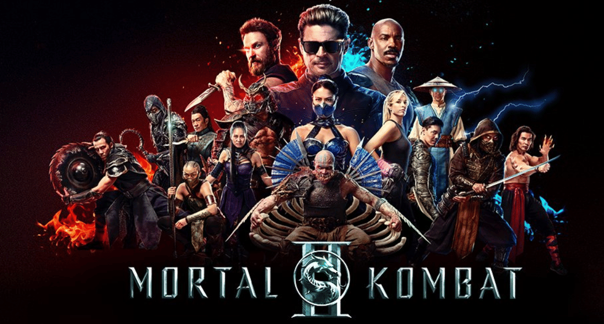

<!-- title: Mortal Kombat 2 (2026) Review — Maximum Fatality, Minimal Story -->
<!-- excerpt: An honest review of Mortal Kombat 2. Packed with epic fatalities and nostalgic vibes from the game, even if the story side feels a bit lacking. -->
<!-- image: ./mortal-kombat-2.png -->
<!-- date: 2026-05-23 -->
<!-- posting_date: 2026-05-23 -->
<!-- tags: Movie Review, Mortal Kombat 2, Action, Nostalgia, Game Adaptation -->

# 🐉 Mortal Kombat 2 (2026) Review  
## Maximum Fatality, Minimal Story

After a long wait and feeling slightly unsatisfied with the first movie, **Mortal Kombat 2** is finally out. As someone who has at least played the game—though not too hardcore—I had my own expectations.

Overall, I give this movie a **7/10**. There are several points that make this movie very interesting and enjoyable, but of course, it's not without its flaws.

Let's break it down one by one!

---

## 🩸 1. Awesome Fatalities (Full Kombat!)

If in the first movie we still felt a "lack of Mortal Kombat", this sequel truly pays off that disappointment. 

From start to finish, we are served with non-stop *full kombat* scenes. And most importantly: **The fatalities are truly maximized.** The executions are brutal, the *gore* is just right, and the visual execution is very pleasing for fans who are indeed looking for the *brutal* aspect typical of Mortal Kombat.

---

## 🎮 2. Nostalgic Settings and Fights

This is one of the main selling points of Mortal Kombat 2. Even though I'm not a player who spent thousands of hours on the game, I can really feel the strong element of nostalgia in this movie.

From the backgrounds (fighting arenas), iconic character *voice lines*, *sound effects*, to the way they execute fatalities—everything really reminds me of the classic Mortal Kombat *gameplay*. It is very satisfying to see these elements brought so respectfully to the big screen.

---

## 🎵 3. Very Catchy Music Theme

To be honest, one of my biggest reasons for wanting to watch this sequel—besides being curious about the continuation of the story—is its **music theme**.

As soon as I listened to the booming *beat music*, it felt really cool and instantly hyped me up! The music successfully builds tension in every fight and makes me even more interested in keeping watching. The *beat* is really sick, so catchy!

---

## 😴 4. Slightly Boring Story That Makes You Sleepy

Now, this is the point that makes me only give a score of 7/10. 

Strangely enough, even though the *pace* of this movie is very fast and full of fights, **the main story feels a bit boring.** There were moments where I felt a little sleepy as the movie tried to build its narrative.

I really enjoyed every *fight* scene, but for the main plot? It lacks punch. Being so focused on the fighting, I feel that this kind of *story* format might be **more suitable as a series rather than a movie.** With a *series* format, they could have more time to build characters and stories without having to sacrifice the portion of epic *fights*.

---

## 🎬 Conclusion

**Mortal Kombat 2 (2026)** is a major *upgrade* in terms of action, fatality visualization, and *fan service*. If you are looking for a pure *action* movie with strong game nostalgia elements and bumping music, this movie is definitely worth watching.

However, if you are looking for a deep narrative and a strong plot, be prepared for a bit of disappointment.

**Final Score: 7/10** ⭐️

Have you watched it yet? Whose fatality is the coolest in your opinion?
