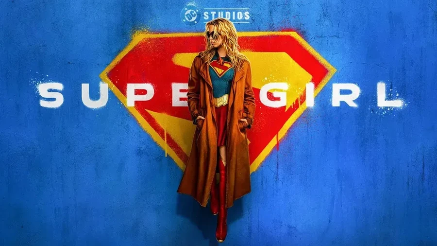

<!-- title: Supergirl (2026) Review — Fun Action but a Flat Story -->
<!-- excerpt: An honest review of Supergirl. Jason Momoa steals the show as Lobo, but the story lacks emotional weight and the space vibes feel too Marvel. -->
<!-- image: ./supergirl.webp -->
<!-- date: 2026-06-28 -->
<!-- posting_date: 2026-06-28 -->
<!-- tags: Movie Review, Supergirl, DCU, Jason Momoa, Action -->

# 🦸‍♀️ Supergirl (2026) Review
## Fun Action but a Flat Story

We finally got to see the *Supergirl* movie adapted from the "Woman of Tomorrow" comic. Unfortunately, for me personally, the movie feels a bit lost in execution.

Overall, I give this movie a **6/10**. Even though it's still quite entertaining to watch, there are a lot of things that just feel flat.

---

## 😴 1. Flat and Emotionless Story

For those of you who know, this movie is based on "Supergirl: Woman of Tomorrow," which is supposed to be rich in emotion and carry deep narrative weight. Sadly, the execution on the big screen doesn't feel emotional at all.

It's very contrasting; you can really tell when a story isn't handled by James Gunn. The narrative ends up being a flop and feels incredibly flat. We expected something touching like the comic, but instead, the movie just goes through the motions.

---

## 🐺 2. Jason Momoa as Lobo Steals the Show

On the bright side, we have Jason Momoa playing Lobo! I have to admit, Lobo truly steals the show here.

From his very first appearance to the final battle, Jason Momoa's performance is spot-on and brings the movie to life. His charisma as Lobo serves as the saving grace amidst a lackluster story.

---

## 🥊 3. Mediocre Action Choreography

This is one of the things I disliked the most about the movie. The choreography for Supergirl's fights feels very mediocre.

Do you remember how Superman's fight choreography was always memorable with every action? Not to mention, Superman's fights had balance, like his intense battles against Lex Luthor. Unfortunately, in this movie, Supergirl's action scenes just feel like basic brawling; one punch, and the enemy goes flying far away. There's no choreography that truly sticks with you or makes you stand up and cheer.

---

## 🌌 4. Space Vibes That Feel Too Marvel

Another disappointing aspect is the depiction of its cosmic world-building. For some reason, the DC space world in this movie gives off massive *Guardians of the Galaxy* vibes.

There is no clear distinction between DC's and Marvel's outer space worlds. The vibes are exactly the same! This feels like a big homework assignment for James Gunn going forward: to update the DC space aesthetic so it has its own identity and stands apart from Marvel.

---

## 🎬 Conclusion

Despite my numerous criticisms, *Supergirl* is still worth watching. Why? Because there's a lot of fighting, and the movie is actually quite fun to enjoy as a light popcorn flick rather than just a boring, flat story.

In short, don't set your expectations too high for the story, and just enjoy the fun action and Lobo's madness on screen!

**Final Score: 6/10** ⭐️

What do you guys think? Do you agree that the DC cosmic world in this movie feels too much like Marvel?