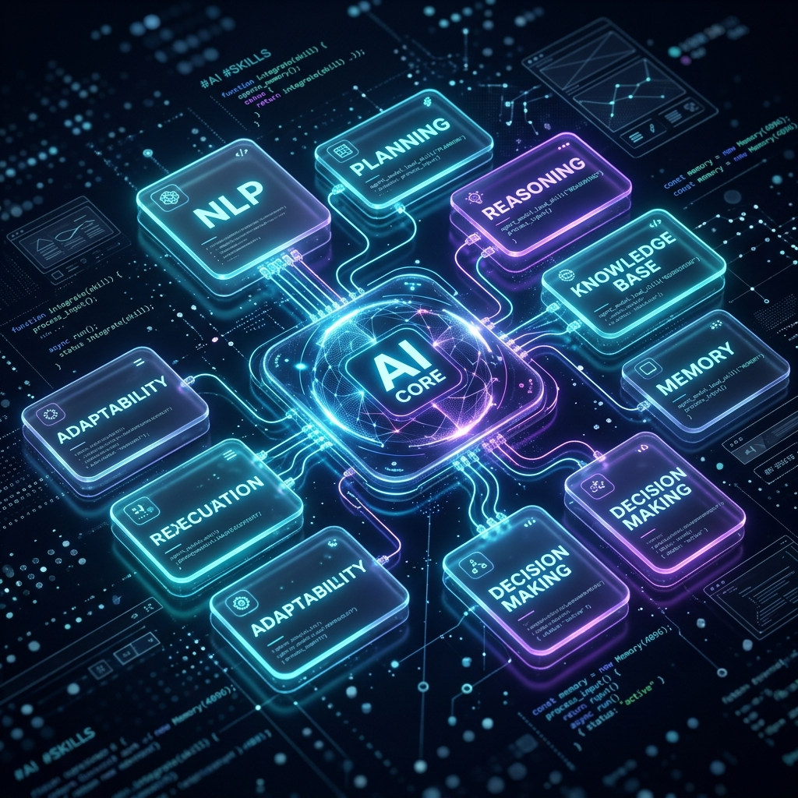

<!-- title: AI Agent Kamu Masih Gitu-Gitu Aja? Saatnya Upgrade dengan "Skills" Biar Nggak Monoton Bawaan AI! -->
<!-- excerpt: Pengalaman pribadiku nemuin rahasia bikin AI Agent jadi super produktif dan anti-monoton. Dengan nge-plug 'Skills' dari UI/UX Pro Max dan Universal Agent Skills dari Addy Osmani, AI Agent-ku sekarang bisa nge-build web premium yang beneran estetik! -->
<!-- image: ./skills-agent-banner.png -->
<!-- date: 2026-05-29 -->
<!-- posting_date: 2026-05-29 -->
<!-- tags: AI Agent, Agent Skills, Developer Workflow, VS Code, productivity, UI/UX, Web Development -->

# 🚀 AI Agent Kamu Masih Gitu-Gitu Aja?  
## Saatnya Upgrade dengan "Skills" Biar Nggak Monoton Bawaan AI!

Jujur aja ya, pernah nggak sih kalian ngerasa kalau hasil codingan AI Agent kalian itu... **monoton banget**? 

Fungsional sih iya, aplikasinya jalan tanpa error. Tapi pas ngeliat tampilannya? Duh, kaku banget. Warna merahnya merah membosankan, layout-nya standar bootstrap purba, tombol-tombolnya kotak tanpa *hover effect*, pokoknya ketara banget kalau itu hasil *generate* AI instan sekali pencet. 

Sebagai developer yang punya standar tinggi, rasanya sedih banget. Kita pengen bikin produk yang *premium*, yang pas pertama kali dibuka langsung bikin orang terkesima (*wow effect*). Tapi kalau setiap kali minta AI buatin UI kita harus nulis prompt sepanjang novel cuma buat ngejelasin *glassmorphism*, gradasi warna HSL, dan *micro-animations*, capek juga kan?

Nah, beberapa hari yang lalu, aku nemuin sebuah konsep game-changer yang bener-bener ngerubah cara kerjaku dengan AI Agent. 

Konsep itu namanya: **Skills**.

---

## 🧠 Apa itu "Skills" pada AI Agent?

Bayangin AI Agent kalian itu seperti seorang software engineer magang yang super pintar dan punya IQ luar biasa tinggi. Dia tahu sintaksis semua bahasa pemrograman, tapi dia nggak punya *pengalaman spesifik* tentang standar industri terupdate atau selera desain modern.

**Skills** adalah modul instruksi, best practices, checklist, dan helper script terstruktur yang bisa kita pasang (*plug-in*) langsung ke dalam otak AI Agent. 

Jadi, alih-alih kita capek-capek nyuapin instruksi panjang lewat prompt setiap kali *chat*, kita cukup install satu folder **Skill** ke sistemnya. AI Agent kita otomatis bakal punya "superpower" baru secara permanen dan menerapkannya di setiap baris kode yang dia tulis untuk kita.

Dan minggu ini, aku baru aja nge-plug dua *skills* luar biasa yang bikin produktivitas dan kualitas kerjaku melesat jauh!

---

## 🛠️ Dua Superpower Baru yang Aku Pasang

Dua *skills* ini punya fokus yang saling melengkapi. Yang satu fokus ke keindahan visual (tubuh), dan satu lagi fokus ke produktivitas dan ketajaman logika (otak).

### 1. 🎨 UI/UX Pro Max Skill (Biar Web Nggak Kaku)
Ini dia penyelamat estetika web-ku! Dikembangkan oleh **nextlevelbuilder**, skill ini dirancang khusus untuk mendidik AI Agent agar selalu menghasilkan desain UI/UX kelas dunia secara otomatis.

* **Repository Github**: [nextlevelbuilder/ui-ux-pro-max-skill](https://github.com/nextlevelbuilder/ui-ux-pro-max-skill)
* **Apa yang berubah?**
  Setelah dipasang skill ini, AI Agent-ku nggak pernah lagi pakai warna-warna generik yang membosankan. Dia sekarang secara otomatis mendesain pakai palet warna HSL yang terkurasi, mengimplementasikan *smooth gradients*, efek *glassmorphism* yang elegan, *micro-animations* yang interaktif saat tombol di-hover, serta tipografi modern dari Google Fonts (seperti Inter atau Outfit).
  
Hasilnya? Setiap komponen UI yang dibuat terasa premium, hidup, dan bener-bener kayak hasil sentuhan desainer profesional, bukan template AI murahan!

### 2. ⚡ Universal AI Agent Skills oleh Addy Osmani (Booster Produktivitas)
Kalau kalian berkecimpung di dunia web performance, nama **Addy Osmani** pasti udah nggak asing lagi. Beliau merilis koleksi *skills* universal yang dirancang untuk melipatgandakan produktivitas AI Agent.

* **Repository Github**: [addyosmani/agent-skills](https://github.com/addyosmani/agent-skills)
* **Apa yang berubah?**
  Skill ini fokus ke efisiensi *software engineering* tingkat lanjut. Dia ngajarin AI Agent cara melakukan analisis codebase secara mendalam, melakukan *context engineering* (agar memori AI tetap fokus dan nggak gampang pikun), debugging terstruktur yang mencari akar masalah (bukan cuma nebak-nebak), hingga otomatisasi alur kerja git.
  
Dengan skill ini, AI Agent-ku nggak cuma coding lebih cepat, tapi juga jauh lebih mandiri. Dia bisa bikin rencana implementasi (`implementation_plan.md`) dan daftar tugas (`task.md`) sendiri untuk melacak pekerjaannya sebelum mulai menulis kode.

---

## 🤝 Kenapa Konsep "Modular Skills" Ini Penting Banget?

Menurutku, era di mana kita memakai satu LLM raksasa yang mencoba tahu segalanya itu udah mulai bergeser. Masa depan *agentic coding* ada pada **modularitas**.

1. **Efisiensi Token & Konteks**: Kita nggak perlu ngejejalin ribuan baris instruksi manual di prompt chat kita. AI Agent cukup membaca file instruksi Skill yang relevan hanya saat dibutuhkan.
2. **Kustomisasi Tanpa Batas**: Hari ini aku mau bikin web premium? Aku plug skill UI/UX. Besok aku mau migrasi database besar? Aku tinggal plug skill database migration. Kita bisa merakit "tim impian" AI kita sendiri.
3. **Peningkatan Kualitas Konsisten**: Karena instruksinya tertulis rapi dalam standar markdown terstruktur (biasanya dalam file `SKILL.md`), AI Agent memiliki panduan baku yang kuat untuk meminimalisir halusinasi atau kode asal-asalan.

---

## 🌱 Refleksi Akhir: Waktunya Kalian Mencoba!

Nge-plug *skills* ke AI Agent-ku terasa seperti momen di mana Iron Man pertama kali memasang Arc Reactor baru ke armornya. Semuanya berjalan lebih mulus, lebih bertenaga, dan hasilnya... bener-bener memanjakan mata.

Sekarang giliran kalian! Jangan biarkan AI Agent kalian bekerja dengan standar bawaan pabrik yang monoton. Manfaatin repositori hebat dari komunitas seperti [UI/UX Pro Max](https://github.com/nextlevelbuilder/ui-ux-pro-max-skill) dan [Agent Skills dari Addy Osmani](https://github.com/addyosmani/agent-skills) untuk naikin level game coding kalian.

Gimana menurut kalian? Apakah kalian udah pernah nyoba pasang *skills* khusus ke AI Agent kalian, atau tertarik buat bikin *skills* versi kalian sendiri? Tulis opini kalian di kolom komentar ya! Sampai jumpa di artikel berikutnya! 🚀
